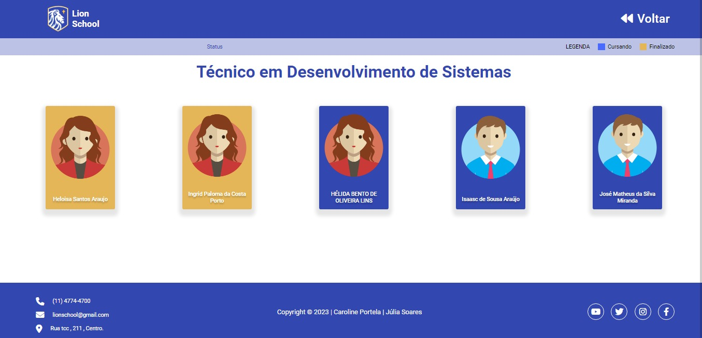

# Lion-School

# Interfaces

 
--- 
 

---
 

 

## Objetivo
Site criado com o objetivo de colocarmos em prática nossos conhecimentos adquiridos no curso do [SENAI - JANDIRA]
Todos as informações/dados desse site vem diretamente de uma API criada pela minha dupla que ficou responsável por todo Back-End, as APIS foram integradas para o Front o deixando totalmente funcional.

 

# Tecnologias utilizadas 

- HTML
- CSS
- Node.js
- JavaScript
- JSON
- Postman
- Markdown
- Responsividade
- Figma

 

[Link - Figma] (https://www.figma.com/file/WlWIzzu0LiC2yAVQ0BrzJa/Untitled?node-id=0-1&t=xvzo2O9MFGO2C9dn-0)
 

- [X] Criou layout conforme designer feito no Figma?
- [X] Os botões dos cursos são dinâmicos?
- [X] Os cards são criados dinamicamente?
- [X] A página com informações dos cursos foi criada dinamicamente?
- [X] O filtro por status está funcional?
- [X] Os nomes das variáveis, funções e arquivos tem valor semântico?
- [X] A maioria das funções seguem as boas práticas como responsabilidade única?
- [X] Foi criado o layout responsivo no Figma?
- [X] Foi implementado a responsividade conforme planejado no Figma?
- [ ] Foi criado o filtro por ano?

 

# Autores

- Front-End: [Caroline Portela](https://github.com/carolineportela)

- Back-End: [Júlia Soares](https://github.com/Xul14)

 

# Professores
- [Marcel Teixeira](https://github.com/marcelnt)

- [Fernando Leonid](https://github.com/fernandoleonid)
